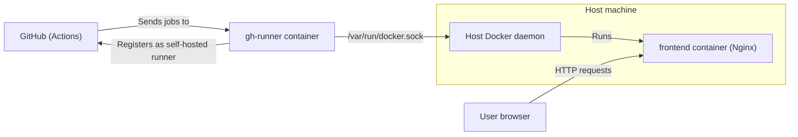

## learn_runner

### Overview

**learn_runner** is a small, Docker-first playground that combines:

- **Frontend**: A React 19 + Vite application (in `frontend`) that can be run locally for development or built and served from an Nginx container.
- **Self‑hosted GitHub Actions runner**: A Docker image (in `github_runner`) that provisions a Linux-based GitHub Actions runner with access to the host Docker daemon.
- **Orchestration**: A minimal `docker-compose.yml` that runs the GitHub Actions runner container and wires it to the host’s Docker socket.

This repository is useful if you want to:

- Experiment with **Vite + React** development and containerized deployment.
- Learn how a **self‑hosted GitHub Actions runner** can be packaged as a container that can itself run Docker jobs.
- Use a lightweight setup for local CI experimentation without touching your main infrastructure.

---

### Repository structure

At the top level:

- **`frontend/`**: React 19 + Vite single-page application.
- **`github_runner/`**: Docker image definition for a self‑hosted GitHub Actions runner.
- **`docker-compose.yml`**: Compose file defining the `gh-runner` service.
- **`README.md`**: This documentation.

Details:

- **`frontend/`**
  - `Dockerfile`: Multi-stage build that:
    - Uses `node:20-alpine` to install dependencies and run `npm run build`.
    - Uses `nginx:alpine` to serve the built static files from `/usr/share/nginx/html`.
  - `package.json`: Vite-based React 19 app with scripts:
    - `npm run dev` – Vite dev server.
    - `npm run build` – Production build.
    - `npm run preview` – Preview production build.
    - `npm run lint` – ESLint checks.
  - `src/`: Application source (`App.jsx`, `main.jsx`, styles).
  - `vite.config.js`, `index.html`, `eslint.config.js`: Standard Vite + ESLint setup.

- **`github_runner/`**
  - `Dockerfile`:
    - Based on `ubuntu:20.04`.
    - Installs tools including `curl`, `git`, `jq`, `docker.io`, etc.
    - Creates a non-root `runner` user with passwordless sudo.
    - Downloads and installs the **GitHub Actions runner v2.330.0**.
    - Copies a `.env` file and `entrypoint.sh` into the image.
    - Adjusts the Docker group GID (`groupmod -g 120 docker`) and adds `runner` to the `docker` group so it can talk to the host Docker daemon.
    - Sets `USER runner` and `ENTRYPOINT ["./entrypoint.sh"]`.
  - `entrypoint.sh`:
    - Expected to register and run the GitHub Actions runner using values from `.env` (e.g., repository/org URL, registration token, runner name, labels).

- **`docker-compose.yml`**
  - Defines service `gh-runner`:
    - `build: ./github_runner` – builds the runner image from the local `github_runner` directory.
    - `restart: always`.
    - `environment`:
      - `DISABLE_AUTO_UPDATE=true` to keep the runner version stable.
    - `volumes`:
      - `/var/run/docker.sock:/var/run/docker.sock` to let jobs inside the runner container run Docker commands on the host.
    - `privileged: true` to allow Docker-in-Docker-like operations.

---

### High-level architecture

At a high level, the system consists of:

- A **GitHub Actions runner container**, built from `github_runner/Dockerfile`, that:
  - Registers itself with a GitHub repository or organization.
  - Listens for and executes workflow jobs.
  - Can run **Docker-based jobs** by using the host’s Docker socket.
- An optional **frontend container**, built from `frontend/Dockerfile`, that:
  - Runs a production build of the React app.
  - Serves static assets via Nginx on port `80`.

The architecture can be visualized as:



Key ideas:

- **Runner vs. GitHub**: The runner container runs `run.sh` from the GitHub Actions runner bundle and stays connected to GitHub to accept workflow jobs.
- **Runner vs. Docker**: The container does not run an inner Docker daemon; instead, it talks directly to the **host** Docker daemon through `/var/run/docker.sock`. This is why group and permissions configuration in `github_runner/Dockerfile` is important.
- **Frontend**: The frontend is logically independent from the runner. You can:
  - Run the frontend locally via `npm run dev`, or
  - Build and serve it via its Dockerfile (as shown in the architecture diagram).

---

### Prerequisites

To use all parts of this project, you will typically need:

- **Host environment**
  - A Linux machine is strongly recommended for running the GitHub runner container (for best compatibility with Docker and GID mappings).
  - Docker installed and running.
  - Docker Compose (v2 or compatible).

- **For frontend local development**
  - Node.js 20.x (or compatible) and npm.

- **For GitHub Actions runner**
  - A GitHub account.
  - A repository or organization where you want to register the self‑hosted runner.
  - A **registration token** generated from GitHub (see official docs).
  - Environment values to put in `github_runner/.env` (see below).

> Note: The `.env` file is **not** committed to the repo and should contain **secrets**. Keep it private.

---

### Environment configuration for the runner

The `github_runner/Dockerfile` copies a `.env` file into the image:

- `COPY .env ./`

This file is expected to provide the necessary values for `entrypoint.sh` to register the runner. A typical `.env` for a repo-level runner might look like:

```bash
REPO_URL=https://github.com/YOUR_USER/YOUR_REPO
RUNNER_TOKEN=YOUR_TOKEN_FROM_GITHUB
```

Where:

- **`REPO_URL`**: Repository or organization URL where the runner will be registered.
- **`RUNNER_TOKEN`**: Short-lived registration token generated via GitHub’s UI. (Do **not** confuse this with a long-lived PAT; use the runner registration token.)

> See the **GitHub Docs**: “Adding self-hosted runners” for the exact registration commands and latest guidance.

---

### Setup & installation

#### 1. Clone the repository

```bash
git clone https://github.com/your-username/learn_runner.git
cd learn_runner
```

#### 2. Frontend dependencies (for local dev)

```bash
cd frontend
npm install
```

This installs React, Vite, ESLint, and related tooling as defined in `frontend/package.json`.

#### 3. GitHub runner `.env`

From the repo root:

```bash
cd github_runner
cp .env.example .env    # if you create a template, otherwise create .env from scratch
```

Edit `.env` and fill in:

- `REPO_URL=https://github.com/YOUR_USER/YOUR_REPO`
- `RUNNER_TOKEN=YOUR_TOKEN_FROM_GITHUB`

according to the “Add runner” instructions from your GitHub repository or organization.

---

### Running the frontend

#### Option A: Local development (Vite dev server)

From the repo root:

```bash
cd frontend
npm run dev
```

By default, Vite will:

- Start a dev server on port `5173` (or the next available port).
- Enable hot-module reloading for React components.

Then open the printed URL in your browser (for example, `http://localhost:5173`).

#### Option B: Production build locally

To build:

```bash
cd frontend
npm run build
```

This creates a production build (by default in the `dist/` directory).

To preview the production build:

```bash
cd frontend
npm run preview
```

#### Option C: Frontend Docker image (Nginx)

The `frontend/Dockerfile` builds and serves the app via Nginx:

```bash
cd frontend
docker build -t learn_runner_frontend .
docker run --rm -p 8080:80 learn_runner_frontend
```

Then open `http://localhost:8080` in your browser.

How it works:

- **Build stage**:
  - Uses `node:20-alpine`.
  - Copies `package*.json`, runs `npm install`, then copies the rest of the app and runs `npm run build`.
- **Runtime stage**:
  - Uses `nginx:alpine`.
  - Copies `dist/` into `/usr/share/nginx/html`.
  - Exposes port `80` and runs Nginx in the foreground.

---

### Running the GitHub Actions runner with Docker Compose

From the repository root (where `docker-compose.yml` lives):

```bash
docker compose build gh-runner
docker compose up -d gh-runner
```

This will:

- Build the `gh-runner` image from `github_runner/Dockerfile`.
- Start a container with:
  - `/var/run/docker.sock` mounted from the host.
  - `DISABLE_AUTO_UPDATE=true` in the environment.
  - `privileged: true`.

To see logs:

```bash
docker compose logs -f gh-runner
```

You should see the entrypoint script registering the runner with GitHub (using your `.env` configuration) and then starting the runner.

To stop the runner:

```bash
docker compose down
```

---

### GitHub Actions runner behavior & configuration

The `github_runner` image:

- Downloads the official GitHub Actions runner tarball:
  - `actions-runner-linux-x64-2.330.0.tar.gz`.
- Runs `./bin/installdependencies.sh` to install system dependencies.
- Defines a `runner` user, adds it to `sudo` and `docker` groups.
- Adjusts the Docker group ID with:
  - `groupmod -g 120 docker || true`
  - Ensures its `docker` group GID matches the host’s `docker` group (commonly 120).
- Switches to `USER runner` so the runner process is non-root, but can still use Docker.

The runner setup flow is typically:

1. `entrypoint.sh` reads environment variables from `.env`.
2. It calls the GitHub Actions runner configuration script (for example, `./config.sh`) with the URL, token, and labels.
3. It starts the runner with `./run.sh`.
4. The container keeps running, keeping the runner online and connected to GitHub.

For detailed and up-to-date steps, see the official documentation for **“Adding self-hosted runners”** on GitHub Docs.

---

### Development workflow

Common tasks:

- **Modify the frontend**
  - Edit files in `frontend/src/`.
  - Run `npm run dev` for a fast feedback loop.
  - Run `npm run lint` to keep code style and best practices in check.

- **Rebuild and run the frontend container**
  - After frontend changes:
    ```bash
    cd frontend
    docker build -t learn_runner_frontend .
    docker run --rm -p 8080:80 learn_runner_frontend
    ```

- **Update or debug the runner**
  - Edit `github_runner/Dockerfile` or `entrypoint.sh`.
  - Rebuild and restart:
    ```bash
    docker compose build gh-runner
    docker compose up -d gh-runner
    docker compose logs -f gh-runner
    ```

- **Cleanup**
  - Stop runner containers:
    ```bash
    docker compose down
    ```
  - Optionally prune old images and containers:
    ```bash
    docker system prune
    ```

---

### Security considerations

- **`/var/run/docker.sock` mount**
  - The `gh-runner` container can control the host Docker daemon.
  - Any job running on this runner can effectively gain root-equivalent control of the host.
  - Treat this setup as **fully trusted** and do **not** expose the runner to untrusted or public workflows.

- **`privileged: true`**
  - The runner container has extended capabilities on the host.
  - This is convenient for CI experiments but not suitable for multi-tenant or untrusted environments.

- **Secrets and `.env`**
  - Do **not** commit `.env` or any secrets to version control.
  - Rotate the GitHub runner registration token or any compromised tokens immediately.

- **Host OS**
  - A Linux host is recommended. Permission mappings (`groupmod -g 120 docker`) are tuned for typical Linux Docker setups.

---

### Troubleshooting

- **Runner does not appear in GitHub**
  - Check `docker compose logs -f gh-runner` for registration errors.
  - Ensure `RUNNER_TOKEN` in `.env` is a **runner registration token**, not a PAT.
  - Confirm `REPO_URL` points to the correct repository or organization.

- **Jobs fail with Docker permission errors**
  - Verify `/var/run/docker.sock` is correctly mounted in `docker-compose.yml`.
  - Ensure the host `docker` group GID matches the value configured via `groupmod -g 120 docker` (or adjust as needed).

- **Port conflict for frontend**
  - If `5173` (dev) or `8080` (Docker) is in use, change the host port:
    ```bash
    docker run --rm -p 3000:80 learn_runner_frontend
    ```
  - Or configure Vite to use a different dev port via CLI flags or config.

- **Runner keeps restarting**
  - Misconfiguration or failing entrypoint logic can cause crashes.
  - Temporarily remove `restart: always` while debugging.
  - Rebuild the image after any changes to `entrypoint.sh` or `.env` expectations.

---

### Future improvements & customization

Ideas for extending this project:

- **Frontend**
  - Add routing, state management, or API integrations to the React app.
  - Containerize additional backend services and connect them to the frontend via Docker Compose.

- **Runner**
  - Parameterize the runner version and URL via build args instead of hardcoding.
  - Support multiple runner containers (e.g., `gh-runner-1`, `gh-runner-2`) with different labels.
  - Add health checks, metrics, or log shipping from the runner container.

- **Infra**
  - Expand `docker-compose.yml` to include the frontend and any other services.
  - Integrate with real CI/CD workflows in your GitHub repository using the self‑hosted runner.

This repository is intentionally minimal so you can adapt it as a learning tool and grow it into a more complete development or CI environment.

